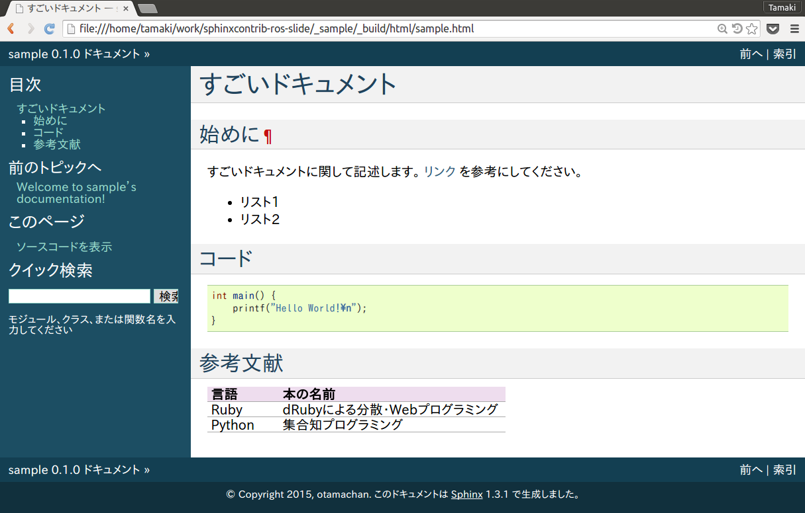
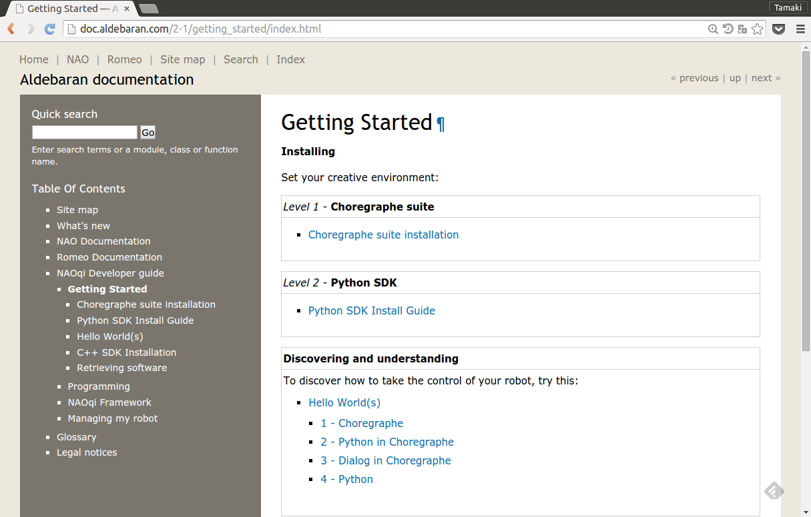
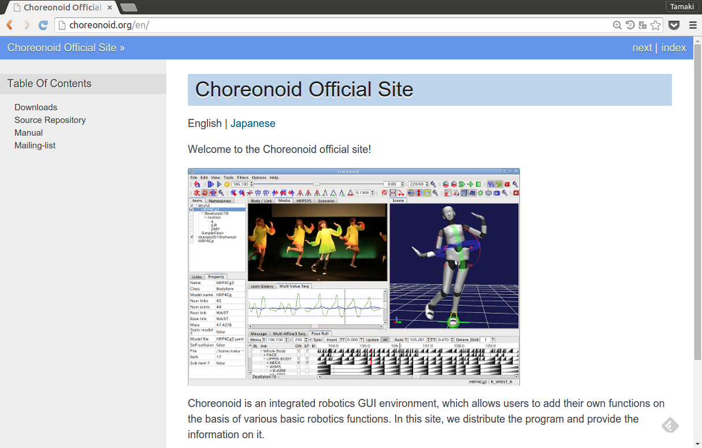
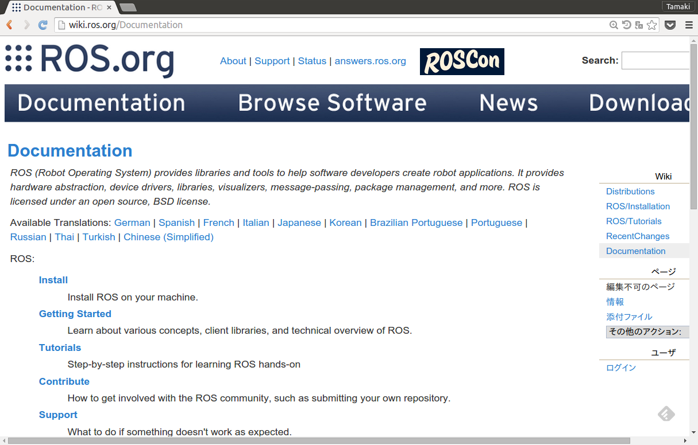
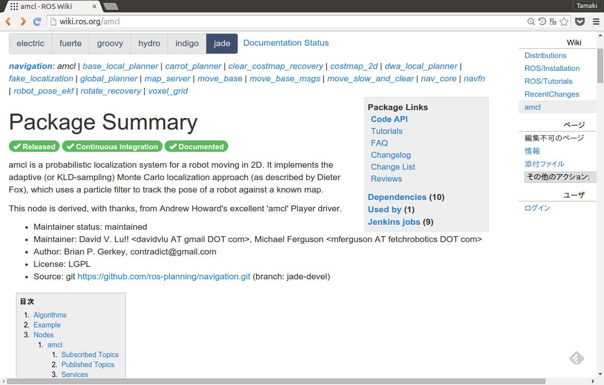
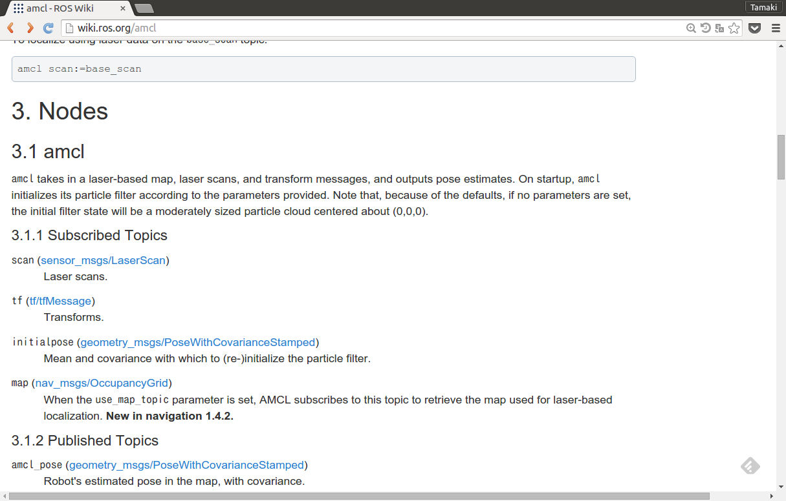
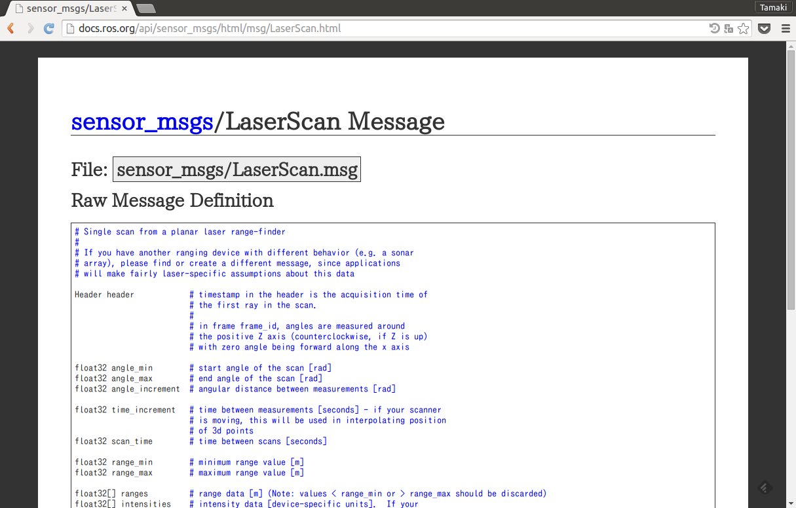

sphinxcontrib-ros紹介
======================

第7回ROS勉強会＠ドワンゴ

by otamachan

自己紹介
--------

* ID: otamachan (Twitter: otamasan)
* 愛知県在住サラリーマン
* 3児のお父さん
* ROSは今年の1月から使い始めました
* 勉強会発表初めて枠

  - Tシャツにつられてしまいました・・・
  - Tシャツ駆動開発
  - Tシャツ怖い

ところで
----------

* みなさんはドキュメント書いてますか？
* ドキュメント書くの好きですか？

私は好きではありません
----------------------

ドキュメント書いていたはずなのに、気づいたら、

  * 音声認識で文書生成するプログラム書いてる
  * Texのマクロいじってる
  * Sphinxの拡張書いてる

ことが多々・・・

そんな私ですが、今日はROSのドキュメンテーションツールを紹介します。

目次
----

#. Sphinxの紹介
#. sphinxcontrib-rosの紹介
#. まとめ

というわけでまずはSphinxの紹介
----------------------------------

`Sphinx <http://sphinx-users.jp/>`_ とは
  * Pythonで書かれたドキュメンテーションツール
  * reStructuredText(マークアップ言語)でドキュメントを記述
  * HTML, PDF, ePub等出力フォーマットが豊富
  * HTMLのテーマも豊富
  * 多言語対応のドキュメントも書ける
  * `Python <http://docs.python.jp/3/>`_ のドキュメントに使用されている
  * `ReadTheDoc <https://readthedocs.org/>`_ といったホスティングサービスも

こんな感じで書くと
------------------

.. rst-class:: small

.. literalinclude:: _sample/sample.rst
   :language: rst

こんな風にかっこよく出力してくれる
----------------------------------

良い点(個人的な感想)
---------------------

* 簡単にかっこ良く書ける
* Gitとかで管理しやすい
* Pythonで拡張が書ける!

使いづらい点(個人的な感想)
--------------------------

* 細かい表現がしづらい(表とか)
* WYSIWYGでない(ビルドのタイムラグがある)
* ソフト屋さんでないと敷居が少し高い

ロボット界でもちらほらSphinxが
------------------------------

NAOqi(Pepper)
-------------

fetch robotics
---------------

Choreonoid
-----------

ROSのドキュメントといえばROS wiki
---------------------------------

こんな感じに書くと
------------------

.. rst-class:: small

.. code-block:: text

   <<PackageHeader(amcl)>>

   {{{
   #!clearsilver CS/NodeAPI
   node.0 {
     name=amcl
     desc=`amcl` takes in a laser-based map, laser scans, and transform messages, and outputs pose estimates. On startup, `amcl` initializes its particle filter according to the parameters provided.  Note that, because of the defaults, if no parameters are set, the initial filter state will be a moderately sized particle cloud centered about (0,0,0).
     sub{
       0.name= scan
       0.type= sensor_msgs/LaserScan
       0.desc= Laser scans.
       1.name= tf
       1.type= tf/tfMessage
       1.desc= Transforms.
       2.name= initialpose
       2.type= geometry_msgs/PoseWithCovarianceStamped
       2.desc= Mean and covariance with which to (re-)initialize the particle filter.
       3.name= map
       3.type= nav_msgs/OccupancyGrid
       3.desc= When the `use_map_topic` parameter is set, AMCL subscribes to this topic to retrieve the map used for laser-based localization. '''New in navigation 1.4.2.'''
     }

パッケージ
-----------

API(Pub/Sub/パラメータ)
------------------------

メッセージ
----------

かっこいい
-----------

.. rst-class:: build

* かも

SphinxでもROSのドキュメントかっこよく書きたい
---------------------------------------------

sphinxcontrib-rosの紹介
------------------------

sphinxcontrib-ros
  SphinxでROSのドキュメンテーションをするための拡張

  #. シンタックスハイライト
  #. パッケージ概要
  #. メッセージ定義
  #. インタフェース

  が書ける。

インストール
------------

#. パッケージインストール

   .. code-block:: bash

      $ pip install sphinxcontrib-ros

#. 設定ファイル(``conf.py``)に追加

   .. code-block:: python

      # 拡張の追加
      extenstions += ['sphinxcontrib.ros']
      # パッケージパスを指定
      ros_package_path = ['../src']

(2)シンタックスハイライト
-------------------------

.. rst-class:: small

.. literalinclude:: _sample/syntax.rst
   :language: rst

出力
----

(1)パッケージ概要
------------------

.. literalinclude:: _sample/package.rst
   :language: rst

出力
----

オプションとか
---------------

(2)メッセージ定義
-----------------

出力
----

(2)メッセージ定義(ファイル指定)
-------------------------------

出力
----

オプションとか
---------------

(3)インターフェース定義
------------------------

出力例
--------

オプションとか
---------------

サンプル
---------

Indigoの

* 全パッケージ
* 全メッセージ(2015/09現在)

を出力してみました。

* TravisCI + Docker (Ubuntu14.04/Indigo !!)

自プロジェクトで使う時
----------------------

* 一から全部メッセージ定義しないといけないの？

大丈夫
-------

* そんな時の `sphinx.ext.intersphinx <http://sphinx-doc.org/latest/ext/intersphinx.html>`_ !

  ``conf.py`` に

  .. code-block:: python

     extensions += ['sphinx.ext.intersphinx']
     intersphinx_mapping = {'ros': ('https://docs.python.org/3.4', None)}

  って書いておけば

  .. code-block:: rst

     .. ros:message:: my_greate_package/NewMessage

  だけで

参照できちゃう
---------------

まとめ
-------

* Tシャツにつられてsphinxcontrib-rosを公開しました
* conf.pyに以下を追加するだけ

  .. code-block:: python

     extensions += ['sphinxconrib.ros', 'sphinx.ext.intersphinx']
     ros_package_path = ['../src']
     intersphinx_mapping = {'ros': ('https://docs.python.org/3.4', None)}

* かっこよくROSのドキュメントが書けちゃうかも

ありがとうございました
----------------------

* **Hope your happy ROS documentation life with Sphinx!**

* ちなみにこのスライドもSphinxで記載しています

  * 拡張: `hieroglyph <https://github.com/nyergler/hieroglyph>`_
  * スライド: `GtiHub <http://www.google.com>`_
  * スライドソース: `GtiHub <http://www.google.com>`_
